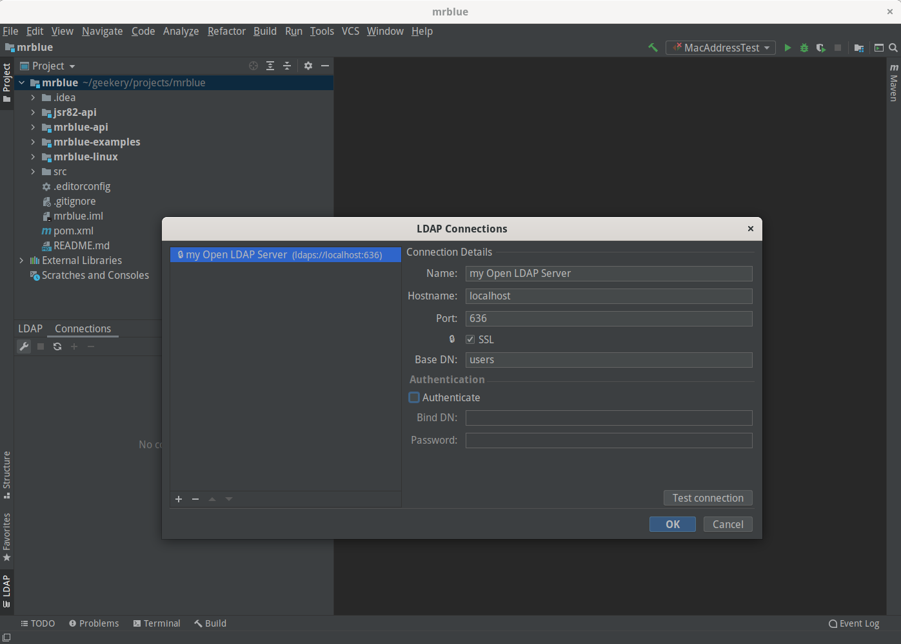

# LDAP plugin for Jetbrains products [](https://opensource.org/licenses/MIT) [](https://travis-ci.org/majk1/ldap-browser-idea-plugin) [](https://plugins.jetbrains.com/plugin/8513-ldap-browser)

This is an LDAP browser plugin for [IntelliJ IDEA](https://www.jetbrains.com/idea) and other Jetbrains products.  
Releases are available from the [Jetbrains plugin repository](https://plugins.jetbrains.com/plugin/8513-ldap-browser).



### Building the plugin

To compile the plugin simply run the following command in the root of the project:

```
./gradlew buildPlugin
```

To run the plugin in a separated IntelliJ Idea sandbox, use the following command:

```
./gradlew runIde
```
